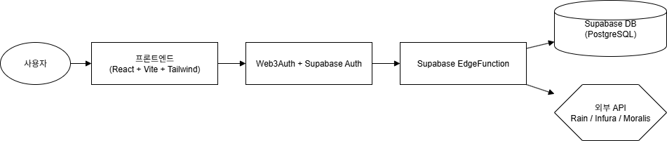

# 📦 Payzme 시스템 아키텍처 설계

## 🎯 프로젝트 개요
Payzme DApp은 Payzme 토큰 기반의 웹 마이닝 및 크립토카드 서비스입니다. 사용자는 로그인 후 마이닝 보상을 받고, 카드 신청 및 결제를 통해 실사용이 가능한 웹 서비스를 제공합니다.

## 🧩 시스템 아키텍처 구성도

## 🧪 핵심 기술 스택

| 계층       | 기술 스택                          |
|------------|-----------------------------------|
| 프론트엔드 | React, TailwindCSS, Vite          |
| 인증       | Supabase Auth + Web3Auth          |
| 백엔드     | Supabase EdgeFunction (Node.js)   |
| DB         | Supabase (PostgreSQL 기반)        |
| 배포       | AWS 또는 Vercel                   |
| 연동       | Rain (카드 API), Infura, Moralis  |

## 🧩 주요 기능별 구성

### 사용자 영역
- Web3Auth 기반 로그인
- 마이닝 (웹 사용 기반)
- 마이닝 부스터: 로그인 보상, 연속 로그인, KYC 인증, 소셜 연동, 레퍼럴
- 추천인 관리 (레퍼럴)
- 카드 신청 및 사용 내역 조회

### 관리자 영역
- 사용자 관리
- 마이닝 현황 확인
- 카드 신청 및 상태 관리

### 외부 연동
- Infura / Moralis: 블록체인 트랜잭션 처리
- Rain API: 카드 신청, 충전, 결제 내역 처리 등

## 🔐 인증 및 보안
- Web3Auth + Supabase 인증
- Supabase JWT 기반 인증
- 클라이언트 측 키 보안 필요

## 🗂 데이터베이스 구조 (요약)

- users: 사용자 정보
- mining_sessions: 마이닝 기록
- referrals: 초대 내역
- cards: 카드 신청 및 발급 정보
- transactions: 결제/입금 내역

## 🌐 인프라 구성

| 항목         | 선택 예정                             |
|--------------|--------------------------------------|
| 클라우드     | AWS 또는 Vercel                      |
| DB & 인증    | Supabase (PostgreSQL)                |
| 배포         | 수동 (CI/CD 없음)                    |
| 모니터링     | Supabase 로그 또는 외부 서비스 연동 |

---
